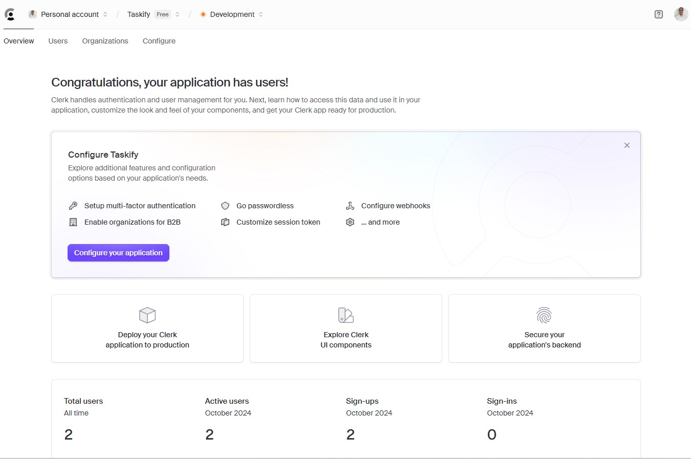
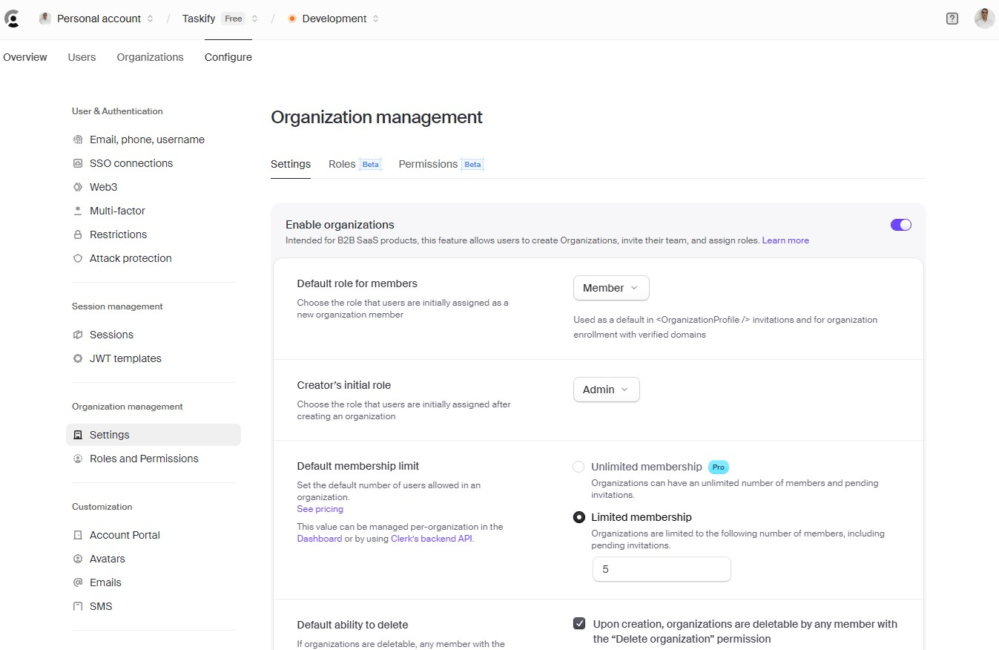

This is a [Next.js](https://nextjs.org) project bootstrapped with [`create-next-app`](https://nextjs.org/docs/app/api-reference/cli/create-next-app).

### Libs 
- [shadcn/ui](https://ui.shadcn.com/docs/cli)

### Develop 
- Create the app
    - `npx create-next-app@latest`
- Define the UI
    - `npx shadcn@latest init`
    - VSCode Plugin: Tailwind CSS IntelliSense
    - `npx shadcn@latest add button`
- Define the Authentication
    - [Dashboard Clerk](https://dashboard.clerk.com/)
    - `npm install @clerk/nextjs`

### Key Features:
- Auth 
- Organizations / Workspaces
- Board creation
- Unsplash API for random beautiful cover images
- Activity log for entire organization
- Board rename and delete
- List creation
- List rename, delete, drag & drop reorder and copy
- Card creation
- Card description, rename, delete, drag & drop reorder and copy
- Card activity log
- Board limit for every organization
- Stripe subscription for each organization to unlock unlimited boards
- Landing page
- MySQL DB
- Prisma ORM
- shadcnUI & TailwindCSS

## Clerk & Auth
[](https://dashboard.clerk.com/)
[](https://clerk.com/docs/references/nextjs/custom-signup-signin-pages)


## Getting Started

First, run the development server:

```bash
npm run dev
# or
yarn dev
# or
pnpm dev
# or
bun dev
```
Open [http://localhost:3000](http://localhost:3000) with your browser to see the result.

You can start editing the page by modifying `app/page.tsx`. The page auto-updates as you edit the file.

This project uses [`next/font`](https://nextjs.org/docs/app/building-your-application/optimizing/fonts) to automatically optimize and load [Geist](https://vercel.com/font), a new font family for Vercel.

## Learn More

To learn more about Next.js, take a look at the following resources:

- [Next.js Documentation](https://nextjs.org/docs) - learn about Next.js features and API.
- [Learn Next.js](https://nextjs.org/learn) - an interactive Next.js tutorial.

You can check out [the Next.js GitHub repository](https://github.com/vercel/next.js) - your feedback and contributions are welcome!

## Deploy on Vercel

The easiest way to deploy your Next.js app is to use the [Vercel Platform](https://vercel.com/new?utm_medium=default-template&filter=next.js&utm_source=create-next-app&utm_campaign=create-next-app-readme) from the creators of Next.js.

Check out our [Next.js deployment documentation](https://nextjs.org/docs/app/building-your-application/deploying) for more details.

## References
- [Getting started](https://nextjs.org/docs/getting-started/installation)
- [Google fonts](https://fonts.google.com/)
- [SVG Repo](https://www.svgrepo.com/collections/multicolor/13)
- [User Management Platform](https://clerk.com/)
- [Auth & Clerk + Next.js](https://clerk.com/docs/quickstarts/nextjs)
- [Build your own sign-in and sign-up pages for your Next.js app with Clerk](https://clerk.com/docs/references/nextjs/custom-signup-signin-pages)
- [Fullstack Trello Clone: Next.js 14, Server Actions, React, Prisma, Stripe, Tailwind, MySQL](https://www.youtube.com/watch?v=pRybm9lXW2c)

